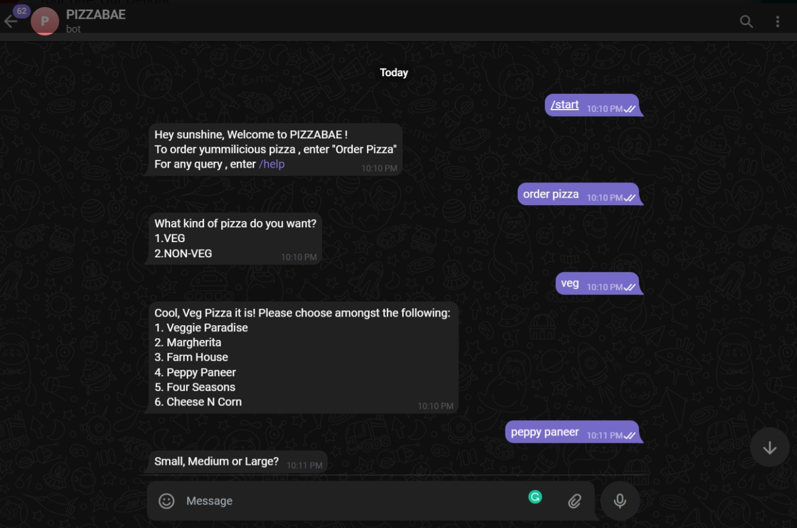
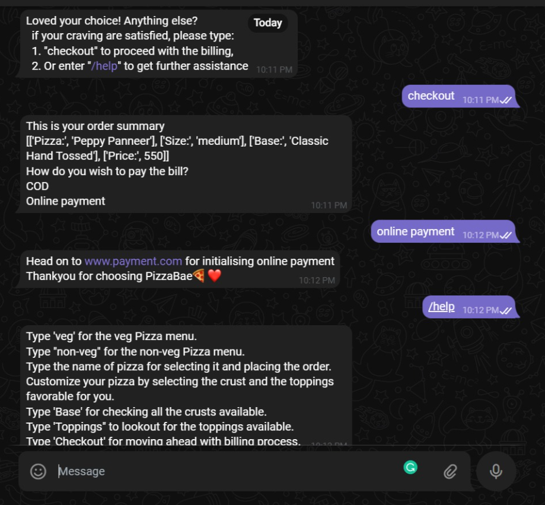

# PizzaBae - Pizza Ordering Chatbot

PizzaBae is a simple and user-friendly chatbot built on Telegram that streamlines the process of ordering pizza for customers. It provides a seamless and interactive experience, allowing users to easily select their preferred toppings, size, and crust, and then place their order with just a few taps.

[Click here](https://www.loom.com/share/f365a66ccd0d437597fd76cdda8d242e) for Video Demo.

## Features

- **Easy Order Placement**: Users can start interacting with PizzaBae by sending a message to the chatbot on Telegram. The chatbot guides them through the ordering process, ensuring a smooth experience from start to finish.

- **Menu Options**: PizzaBae offers a menu of both vegetarian and non-vegetarian pizzas. Users can explore the available options and choose their desired pizza type.

- **Customization**: Users can customize their pizza by selecting their preferred toppings. PizzaBae provides a variety of toppings to choose from, allowing users to create their perfect pizza.

- **Crust Selection**: PizzaBae offers different crust options such as thin crust, thick crust, and classic hand-tossed. Users can choose the crust that suits their taste.

- **Order Tracking**: PizzaBae integrates with a pizza delivery service, enabling users to track their order status in real-time. They can receive updates on delivery times and stay informed about the progress of their order.

- **Payment Options**: PizzaBae supports both Cash on Delivery (COD) and online payment methods, providing users with flexibility in completing their transactions.

## How to Use

To use PizzaBae, follow these steps:

1. Open Telegram and search for "BotFather".
2. Follow the instructions to create a new bot using the "/newbot" command.
3. Store the generated API key for your bot.
4. Clone the PizzaBae repository from GitHub.
5. In the `constants.py` file, replace the placeholder API key with the API key you obtained from BotFather.
6. Deploy the PizzaBae bot on the Replit platform or any other hosting service of your choice.
7. Start a conversation with PizzaBae on Telegram by searching for your bot's name and selecting it.
8. Begin the ordering process by sending the "/start" command to PizzaBae.
9. Follow the prompts and provide the required information such as pizza type, toppings, size, crust, and payment method.
10. Once you have completed the order, PizzaBae will provide confirmation and order tracking details.

Enjoy ordering your favorite pizza hassle-free with PizzaBae!

## Screenshots

## Technologies Used

- Telegram Bot API
- Python
- Replit (Deployment platform)
- GitHub (Version control and hosting)

Thank you for choosing PizzaBae for your pizza ordering needs! 🍕❤️